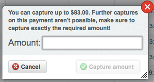
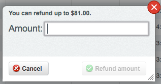

# Payment administration guide

This is a short introduction to managing payments in the SilverStripe CMS. Payments can show up at different places, for example when opening an order in [silvershop](https://github.com/silvershop/silvershop-core), you'll see all payments that are linked to this order.

There's also a central place for all payments, to be found under "Payments" in the CMS.

There you'll find a list of all payments that went through the SilverStripe Omnipay module.

## Payment actions

There are several actions that can be performed on payments. The actions available to you are mainly dependent on the current payment-status. Limitations of the payment-gateway or [security restrictions](#security-settings) can further restrict the possible actions. The actions will show up in the payments GridField. Here's an example:

### Available actions

Please note, that none of these buttons will perform an action immediately. All of them will open a dialog that requires confirmation!

| Action | Button | Description
| ------ | -------| ----
| **[Capture](#capture)** |  | Capture an *Authorized* payment. Only the captured amount will be charged to the payers credit-card! Depending on the gateway capabilities, you can either: Only capture the *full amount*, capture a variable amount *once* or capture variable amounts *multiple times*.
| **[Void](#void)** |  | Void an *Authorized* payment. This will cancel an authorized payment. The funds will never be charged to the payers credit-card.
| **[Refund](#refund)** |  | Refund a *Captured* payment. The funds will be returned to the payer. Depending on the gateway capabilities, you can either: Only refund the *full amount*, refund a variable amount *once* or refund variable amounts *multiple times*. **Please note, that some payment-providers will add a fee to refunds!**

### Capture

Captures an authorized payment. Only the captured amount will be charged to the payers credit-card!

When clicking the "Capture" button in the CMS, a dialog will open:

Once you enter a valid amount in the input-field, the "Capture amount" button will become active. Valid values are all non-negative numbers that don't exceed the maximal amount. Fractional values can be entered with a period. Example: `81.45`

Enter the desired amount and click "Capture amount" to perform the capture. Please note, that you can not capture more than the amount mentioned in the dialog. Depending on the Gateway, this amount can be higher than the authorized amount though! That is, because some payment providers allow capturing slightly more than authorized (PayPal allows +15%, capped at USD $75.00).

When capturing an amount of `81` – or any partial amount for that matter, the initial payment will convert into two payment-objects. One payment will list the captured amount, and the other will list the remaining amount. Depending on the payment gateway, the remaining amount will still be "Authorized" (in case multiple captures are possible), otherwise the payment status will change to "Refunded" (which isn't really a refund, since the amount was never charged on the payers credit-card to begin with).

#### Getting a different dialog/result?

Depending on the gateway capabilities, the dialog might look different than above. Some gateways only allow full captures, which results in a dialog like this:

Some gateways allow multiple partial captures, which will show a dialog like this:

### Void

Void an authorized payment. This will cancel an authorized payment. The funds will never be charged to the payers credit-card.

When clicking the "Void" button in the CMS, a dialog will open:

Confirm by clicking the "Void payment" button. The payment will change its status to "Void" and the authorized funds will no longer be available to you for capture.

### Refund

Refund a captured payment. The funds will be returned to the payer. In the image below you see a payment that was captured and can be refunded:

When clicking the "Refund" button in the CMS, a dialog will open:

Once you enter a valid amount in the input-field, the "Refund amount" button will become active. Valid values are all non-negative numbers that don't exceed the maximal amount. Fractional values can be entered with a period. Example: `77.95`.

Refunds can have different dialogs, much like [capture](#capture). Depending on the selected gateway, only full refunds, single partial refunds or multiple partial refunds are possible. The screenshot above shows a dialog for a gateway that allows multiple partial refunds.

## Security settings

Administrators can control payment permissions in the "Security" section of the CMS. There are three permissions:

- Capture payments
- Refund payments
- Void payments

A user in a group that has only the "Capture payments" permission won't be able to perform refunds or void payments!

Here's a screenshot how the permission-settings look:

